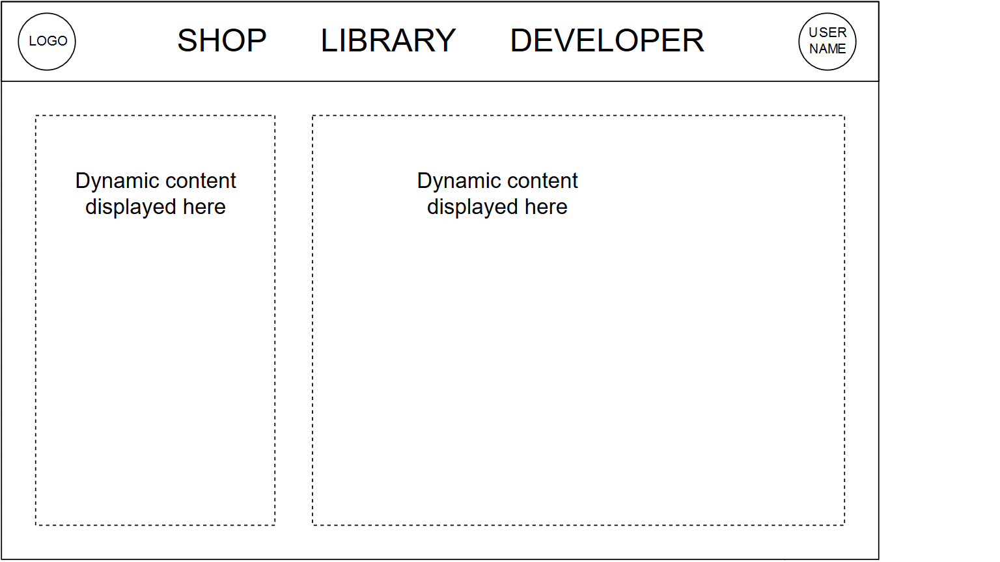
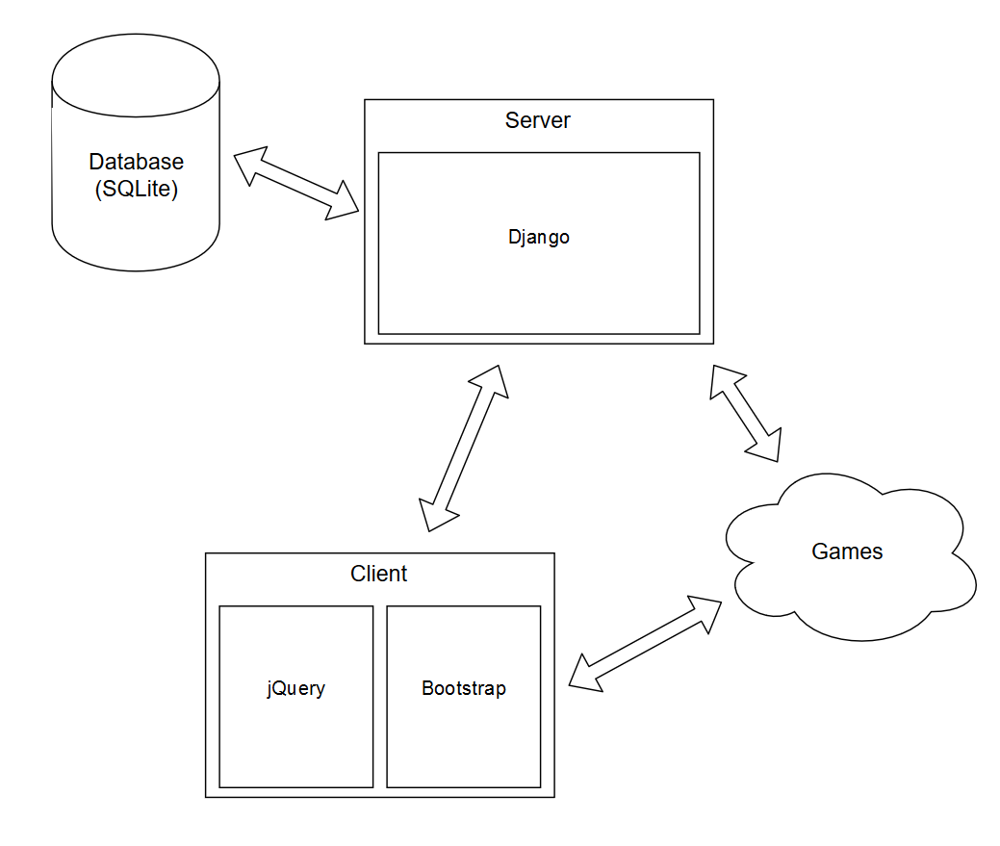

# Online Game Store 

An online game store project developed in the Django framework. It provides all features typical of
any online store with modules such as buying, uploading, viewing and lastly searching games. It also
supports third-party login such as Gmail.

## 1. Authors

Pauli Lohi  
Panu Liesiö  
Muhammad Abdullah Khan  

## 2. Plan

### 2.1 Goals

    -Modern web app  
    -Mobile friendly  
    -Dynamic, responsive and clean user interface design  
    -Secure  

### 2.2 Model

    -Django backend  
        -Shop view: The user can browse the games catalog here, and buy games  
        -Library view: The user can acceess the games they have bought. Launching a game
         changes the view to the game  
        -Developer view: If the user is a developer they can access their game projects
         here and also view any sales statistics.  
        -Game view: Each game is routed to its own view via an unique url. This view
         renders the game itself, but also the highscores for that game.  
    -jQuery + Bootstrap frontend  
    -SQLite database  
        -User account information  
        -Game information  

    
### 2.3 Features
    -Authentication  
        -User account registration with e-mail verification  
        -Developer and player accounts  
    -Basic player functionalities  
    -Basic developer functionalities  
    -Game/service interaction  
    -Save/load and resolution feature  
    -Mobile Friendly  
    -Own game  
    -RESTful API  
    -3rd party login  
        -Google account
  
## 3 Setup Instructions

<b>Setup Commands</b>

    virtualenv -p python3 venv (Setup virtual environment)  
    source venv/bin/activate (Activate virtual envirionment)  
    pip install -r requirements.txt (Install all libraries using PIP)  

<b>Migration Commands</b>

    python manage.py makemigrations (Create all schemas for database)  
    python manage.py migrate (Make all schema changes take effect)  
    python manage.py createsuperuser (Create Adminstrator for managing the website)  
    python manage.py runserver (Run the project)  

## 4 Heroku Deployment Instructions

### 4.1 Pre-conditions

1. Setup Heroku Account
2. App running locally without errors
3. Heroku CLI Installed (wget -qO- https://cli-assets.heroku.com/install-ubuntu.sh | sh) (For Linux)

### 4.2 Steps

    heroku login (Enter credentials for heroku)  
    heroku create --buildpack heroku/python (Heroku App buildpack creation)  
    heroku git:remote -a <Name of the app on heroku>  
    git push heroku <your-branch-name>:master  

### 4.3 Migrations

For making the migrations, repeat the same commands stated in the migrations and static file generation but add <i>heroku run</i> to the start of the command. For example: 

    heroku run python manage.py runserver
	 

